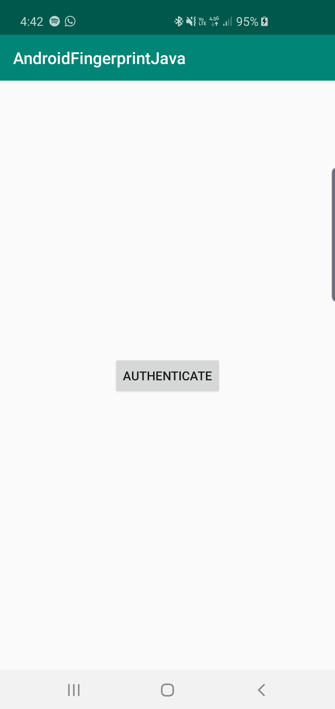
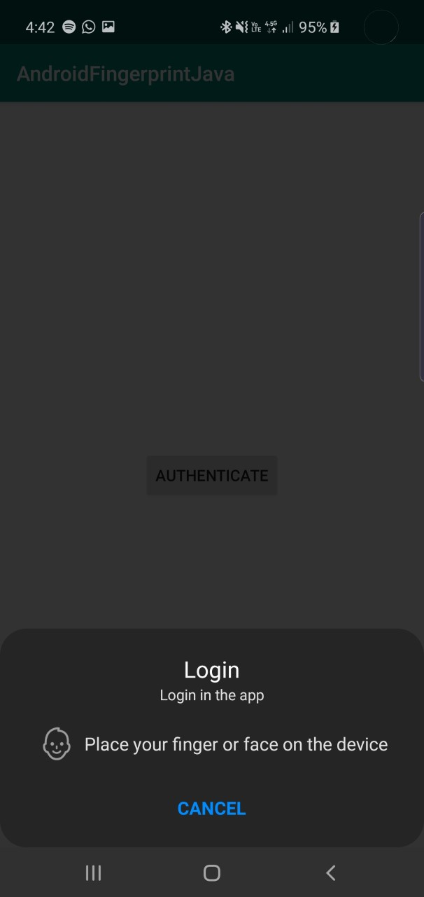
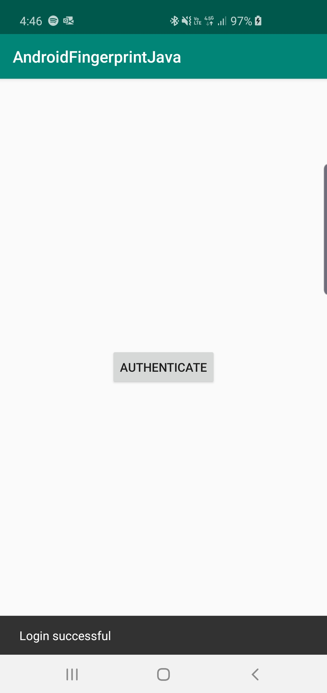

# Authentication

Add to your project build.gradle
```gradle
allprojects {
	repositories {
		...
		maven { url "https://jitpack.io" }
	}
}
```

Add to your app module build.gradle
```gradle
dependencies {
        compile 'com.github.RicardoBravoA:AndroidAuthenticationJava:1.1.0'
}
```

<p align="center">
  
  
  
</p>

Need implements AuthenticationListener in your activity
```java
    @Override
    public void onSdkVersionNotSupported() {}

    @Override
    public void onAuthenticationNotSupported() {}

    @Override
    public void onAuthenticationNotAvailable() {}

    @Override
    public void onAuthenticationPermissionNotGranted() {}

    @Override
    public void onAuthenticationInternalError(String error) {}

    @Override
    public void onAuthenticationFailed() {}

    @Override
    public void onAuthenticationCancelled() {}

    @Override
    public void onAuthenticationSuccessful() {}

    @Override
    public void onAuthenticationHelp(int helpCode, CharSequence message) {}

    @Override
    public void onAuthenticationError(int errorCode, CharSequence message) {}
```

For instace of BottomSheetDialogFragment, you need:
```java
    AuthenticationEntity authenticationEntity = new AuthenticationEntity.AuthenticationBuilder()
                    .setTitle(TITLE)
                    .setSubtitle(SUBTITLE)
                    .setDescription(DESCRIPTION)
                    .setButtonText(BUTTON)
                    .build();

    AuthenticationManager authenticationManager = new AuthenticationManager();
    authenticationManager.authenticate(this, authenticationEntity, this);
```

Happy coding!


License
--------

    Copyright © 2019 Ricardo Bravo

    Licensed under the Apache License, Version 2.0 (the "License");
    you may not use this file except in compliance with the License.
    You may obtain a copy of the License at

       http://www.apache.org/licenses/LICENSE-2.0

    Unless required by applicable law or agreed to in writing, software
    distributed under the License is distributed on an "AS IS" BASIS,
    WITHOUT WARRANTIES OR CONDITIONS OF ANY KIND, either express or implied.
    See the License for the specific language governing permissions and
    limitations under the License.